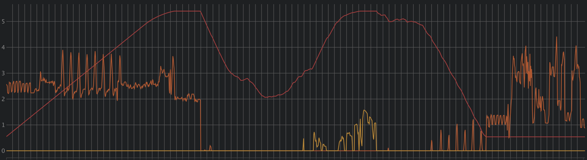
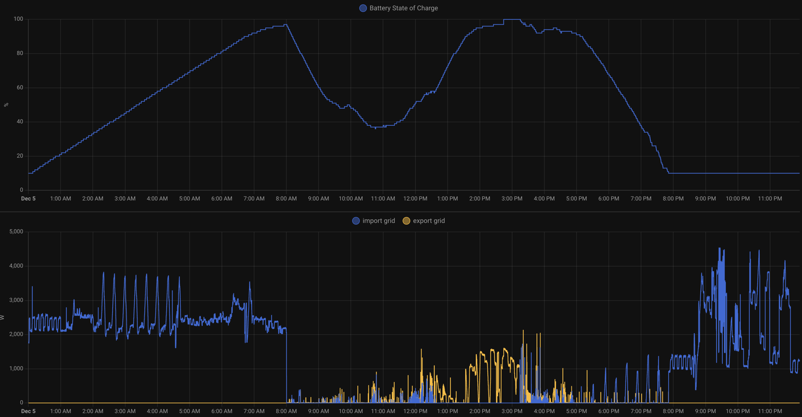
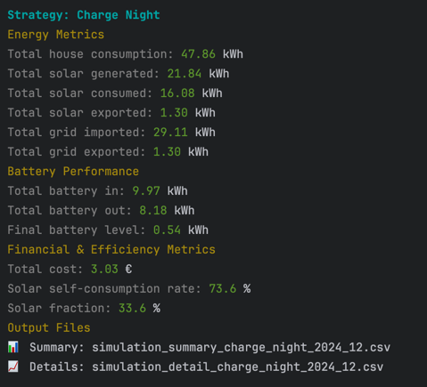
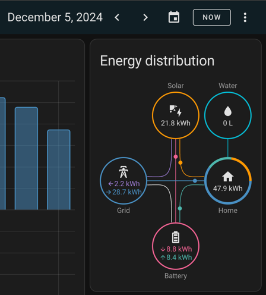

# Solar Battery Optimization Simulator (v0.1)

## Overview
A Python-based simulator for optimizing solar PV systems with battery storage. The simulator allows testing different
battery management strategies to maximize cost savings and efficiency by analyzing historical generation 
and consumption data.
Initial version, more of a proof of concept, code is ugly, and there is a lot of room for improvement.

## Why
The project aims to optimize a PV installation with battery by exploring different charging strategies:
- Self-consume strategy: Battery charges from solar and discharges when load exceeds production
- Force charge at night strategy: Battery charges from solar and discharges when load exceeds production, but it also
  forces the battery to charge at night to take advantage of lower prices
- Other strategies are possible like predictive charging, weather-aware charging, etc.

You can also explore what would happen if you increased the number of batteries, in my case, adding another battery
increases the maximum power of the battery system from 2kW to 5kW. Or what happens when export limit is changed...

## Simulation vs Ground Truth
Inputs of the simulation are solar power and house load. Simulation granularity is 1 minute, and the scenario is force
charging the battery at night.
Estimated metrics are also almost spot on when compared with Home Assistant's energy dashboard.
Some discrepancies might arise because we are not simulating battery behavior in detail, but rather a simplified model.
End to end efficiency of solar panels, battery, and inverter isn't modeled, but rather a simplified model.

### Simulation

### Ground Truth


| Simulation                          | Ground Truth                                   |
|-------------------------------------|------------------------------------------------|
|  |  |


## Installation
```bash
# Clone repository
git clone https://github.com/leandroalbero/solar-battery-optimizer.git
cd solar-battery-optimizer

# Create virtual environment
python -m venv .venv
source .venv/bin/activate

# Install dependencies
pip install -r requirements.txt
```

## Usage
1. Prepare input data:
   - Solar generation CSV with datetime index and 'state' column measured in W
   - Load consumption CSV with datetime index and 'state' column measured in W
   - Ensure data is in the correct timezone

2. Configure system parameters:
```python
tariff = PowerTariff(
    import_rate_schedule={(0, 8): 0.085, (8, 10): 0.134, ...},
    export_rate_schedule={(0, 24): 0.08}
)

battery = Battery(capacity=5, max_charge_rate=2.0, max_discharge_rate=2.0)
```

3. Run simulation:
```python
sim = EnergySimulator(battery, load, grid, tariff, solar)
for timestamp in load_data.index:
    sim.step(timestamp, prev_timestamp, strategy='self_consume')
```

4. Analyze results:
```python
results = sim.get_metrics()
print(f"Total cost: {results['total_cost']:,.2f}€")
print(f"Solar self-consumption rate: {results['self_consumption_rate']:.1f}%")
```

## Future Plans (with no particular order)
1. Implement additional battery management strategies:
   - Time-of-use optimization
   - Weather-aware charging
   - Peak demand reduction
2. Create Home Assistant integration for strategy execution
3. Implement predictive modeling capabilities
4. Add support for varying solar capacity
5. Better UX/UI for data visualization
6. Better modeling of entities in the code, code cleanup/refactor is needed

## Contributing
Contributions are welcome! Please open an issue or submit a pull request for any improvements or bug fixes.
