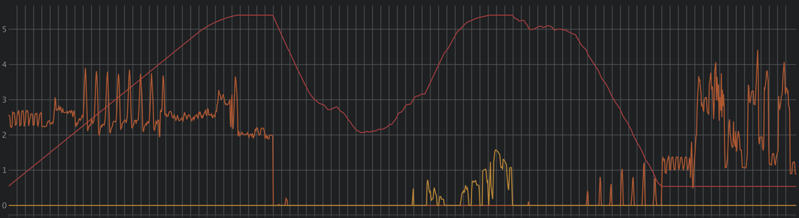
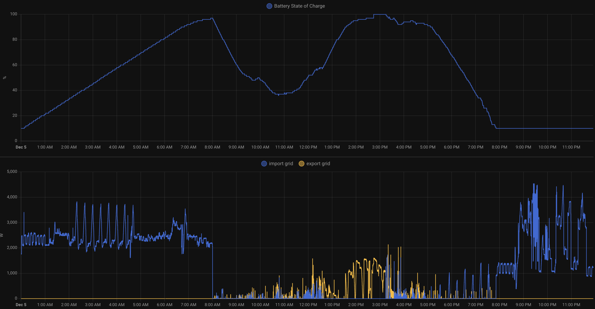
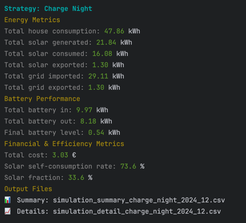
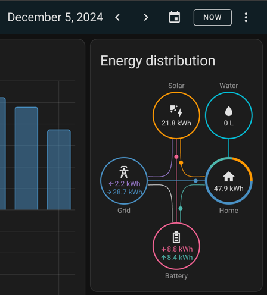

# **Powerflow** energy optimization simulator


## Overview
A Python-based simulator for optimizing solar PV systems with battery storage. The simulator allows testing different
battery management strategies to maximize cost savings and efficiency by analyzing historical generation 
and consumption data.

> [!IMPORTANT]
> Some metrics are yet to be validated, this is more of a proof of concept than anything else. Code is messy
> and there are no tests, so use at your own risk. 💃😄

## Why
The project aims to optimize a PV installation with battery by exploring different charging strategies:
- Self-consume strategy: Battery charges from solar and discharges when load exceeds production
- Force charge at night strategy: Battery charges from solar and discharges when load exceeds production, but it also
  forces the battery to charge at night to take advantage of lower prices
- Other strategies are possible like predictive charging, weather-aware charging, etc.

You can also explore what would happen if you increased the number of batteries, in my case, adding another battery
increases the maximum power of the battery system from 2kW to 5kW. Or what happens when export limit is changed...

## Simulation vs Ground Truth
Inputs of the simulation are solar power and house load, outputs are battery SoC (kWh) and import/export grid (kW). 
Simulation granularity is 1 minute, and the shown scenario is force charging the battery at night.

Estimated metrics are almost spot on when compared with Home Assistant's energy dashboard.
Some discrepancies might arise because we are not simulating battery behavior in detail, but rather a simplified model.
End to end efficiency of solar panels, battery, and inverter isn't modeled, but rather a simplified model.
### WebUI

### Simulation

### Ground Truth


| Simulation                          | Ground Truth                                   |
|-------------------------------------|------------------------------------------------|
|  |  |


## Quick Start (Docker)
```bash
git clone https://github.com/leandroalbero/powerflow-simulator.git
cd powerflow-simulator
docker compose up --build
```
Open http://localhost:8000 — the image includes one month of sample data (January 2024, 1-minute resolution).

To use your own full dataset, uncomment the volume mount in `docker-compose.yml`:
```yaml
volumes:
  - ./data:/app/data
```

## Local Development
```bash
# Create virtual environment
python -m venv .venv
source .venv/bin/activate

# Install dependencies
pip install -r requirements.txt

# Install frontend dependencies
cd web/frontend && npm install && cd ../..

# Start backend + frontend dev servers
make web-dev
```
Backend runs on http://localhost:8000, frontend dev server on http://localhost:5173.

## Data
Input CSVs need a `last_changed` datetime index and a `state` column (values in Watts):
```csv
"last_changed","state"
"2024-01-01T00:00:00.000+01:00","1424.67"
```
The `data/` folder contains real data — high-res (1-minute) and low-res (1-hour) versions. The `data/sample/` folder has a January 2024 subset used by the Docker image.

## Programmatic Usage
```python
tariff = PowerTariff(
    import_rate_schedule={(0, 8): 0.085, (8, 10): 0.134, ...},
    export_rate_schedule={(0, 24): 0.08}
)

battery = Battery(capacity=5, max_charge_rate=2.0, max_discharge_rate=2.0)

sim = EnergySimulator(battery, load, grid, tariff, solar)
for timestamp in load_data.index:
    sim.step(timestamp, prev_timestamp, strategy='self_consume')

results = sim.get_metrics()
```

## Future Plans (with no particular order)
1. Implement additional battery management strategies:
   - Time-of-use optimization
   - Weather-aware charging
   - Peak demand reduction
2. Create Home Assistant integration for strategy execution
3. Implement predictive modeling capabilities
4. Add support for varying solar capacity
5. Better UX/UI for data visualization
6. Better modeling of entities in the code, code cleanup/refactor is needed

## Contributing
Contributions are welcome! Please open an issue or submit a pull request for any improvements or bug fixes.
